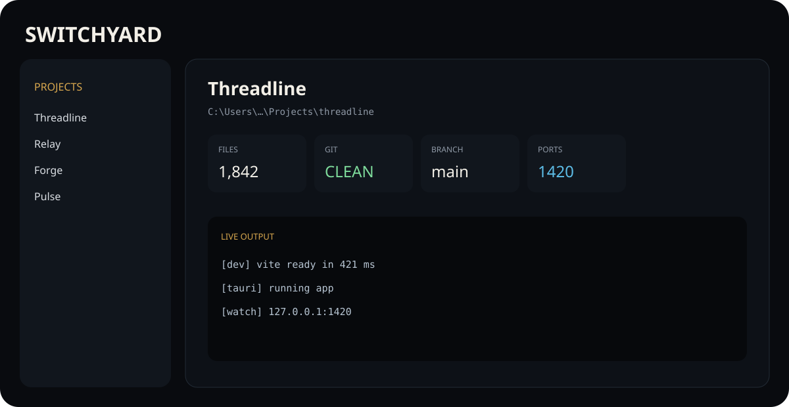

# Switchyard

> A local-first developer command center for understanding projects, running services, and bringing an entire development workspace online in the right order.



Switchyard is the flagship Purysho desktop tool. It sits above individual repositories and gives you one place to understand a project, remember how it runs, orchestrate related services, and inspect what is happening while they are alive.

## What it does now

### Workspace intelligence

Add any local project and Switchyard can surface:

- file and repository size
- Git branch, dirty state, upstream, ahead/behind counts, origin, and latest commit
- detected stacks such as Node.js, React, Next.js, Tauri, Python, Rust, Go, .NET, Java, and Docker
- common runnable tasks from project metadata
- project health checks and likely development ports
- notes, tags, pinning, and recent-project ordering

Detection is advisory. Switchyard does not silently execute discovered commands.

### Run configurations

Save project commands and run them from one place with:

- custom working directories
- environment variables in the underlying model
- live combined logs
- stop and restart controls
- persisted run history
- bounded log memory for long-running processes

A run configuration can be promoted into a service when it becomes part of a larger workspace.

### Services

A service is a command with operational meaning. Each service has:

- a project
- a command and optional working directory
- dependencies on other services
- a readiness rule
- a startup timeout
- a failure policy

Supported readiness gates:

- **process** — continue once the process survives startup
- **port** — continue when a TCP port begins listening
- **delay** — continue after a deliberate startup delay

Switchyard validates dependency graphs and rejects cycles or missing dependencies.

### Workspace sessions

A session is a named service topology such as:

```text
DATABASE
   ↓
API
   ↓
WEB
```

Starting a session causes Switchyard to:

1. expand required dependencies
2. calculate a deterministic topological start order
3. launch each service
4. wait for its readiness condition
5. start dependents only after their prerequisites are ready
6. expose service state and live output
7. stop the topology in reverse dependency order

Unexpected service failures can cascade to dependent services when `stop_dependents` is selected. Session events are recorded in a persistent operational timeline.

## Why Switchyard exists

Modern development frequently means remembering which repository, terminal command, port, environment, and startup order belongs to which project. Generic terminals know commands. Task managers know processes. IDEs know the current repository.

Switchyard's job is to know the **workspace**.

It is intentionally local-first:

- no account
- no cloud workspace
- no telemetry dependency
- no hosted orchestration service
- project files are never uploaded by Switchyard

## Running from source

Requires Python 3.11+ with Tk available.

```bash
python switchyard_desktop.pyw
```

Tests:

```bash
python -m unittest discover -s tests -v
```

## Windows build

```powershell
./build-windows.ps1
```

The repository CI runs the test suite and Windows build checks. Tagged release workflows can publish the packaged executable and checksum.

## State

Switchyard stores its local workspace state at:

```text
~/.switchyard/state.json
```

The state format is versioned. Phase 3 uses schema version `3` and continues to load older V1/V2 state files.

## Safety model

Switchyard runs commands you explicitly save or import. Detected tasks remain suggestions until you choose to import or promote them. Service readiness only performs local process timing and TCP checks; it does not expose ports or configure networking.

See [SECURITY.md](SECURITY.md) for security reporting and [docs/ARCHITECTURE.md](docs/ARCHITECTURE.md) for the internal model.

## Roadmap

Phase 3 establishes service orchestration and workspace sessions. The next major work is environment profiles, richer readiness/health probes, crash recovery, and a stronger topology view.

See [docs/ROADMAP.md](docs/ROADMAP.md).

## License

MIT.
